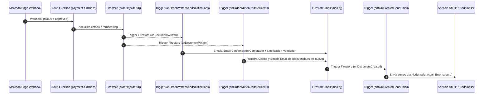

# Sistema de Notificaciones por Correo Transaccional

Este documento describe la arquitectura, configuración y flujo de trabajo del servicio de notificaciones por correo electrónico transaccional en la plataforma **Vertex Commerce**.

---

## 📋 Variables de Entorno Requeridas

Para habilitar el envío de correos electrónicos a través de transporte SMTP (Servicios como SendGrid, Mailgun, Amazon SES o SMTP personalizado), configura las siguientes variables en las Cloud Functions o archivo `.env`:

| Variable | Tipo | Descripción | Ejemplo |
|---|---|---|---|
| `SMTP_HOST` | String | Servidor SMTP | `smtp.sendgrid.net` o `smtp.gmail.com` |
| `SMTP_PORT` | Number | Puerto SMTP (default: `587`) | `587` (TLS) o `465` (SSL) |
| `SMTP_USER` | String | Nombre de usuario o API Key SMTP | `apikey` |
| `SMTP_PASS` | String | Contraseña o secreto del usuario SMTP | `SG.xxxxxxxxxxxxxxxxxx` |
| `FROM_EMAIL` | String | Dirección remitente oficial por defecto | `no-reply@tudominio.com` |
| `NOTIFICATION_EMAIL` | String | Email de respaldo para notificaciones de ventas | `ventas@tudominio.com` |

> **Nota para Desarrollo**: Si `SMTP_HOST` o `SMTP_USER` no están configurados, el servicio registrará un log informativo en Cloud Logging (`[EmailService] SMTP credentials missing, skipping email send in DEV`) sin fallar la ejecución de las funciones ni interrumpir los webhooks.

---

## 🔄 Flujo Lógico de Notificaciones



---

## ✉️ Tipos de Correos Transaccionales

1. **Confirmación al Comprador**: Se genera tras la aprobación del pago. Incluye el desglose de ítems, cantidad, precios, precio total, dirección de envío y número de orden.
2. **Notificación de Nueva Venta al Vendedor**: Enviada a `storeConfig.notificationEmail` o `NOTIFICATION_EMAIL` con detalles de la venta y enlace directo para administrar el pedido desde el panel `/admin`.
3. **Email de Bienvenida a Nuevos Clientes**: Registra al comprador en la colección `clients` de la tienda y encola un correo de bienvenida si se trata de su primera compra.

---

## 🧪 Pruebas en Entorno Local

1. **Pruebas de Funciones de Email**:
   ```bash
   npm run test --prefix storefront/functions
   ```

2. **Probar Envío Avanzado desde Admin Panel**:
   Desde la sección de *Configuración -> Notificaciones por Email* del panel `/admin`, utilizá la función `sendAdvancedTestEmail` para probar plantillas y variables en tiempo real.
